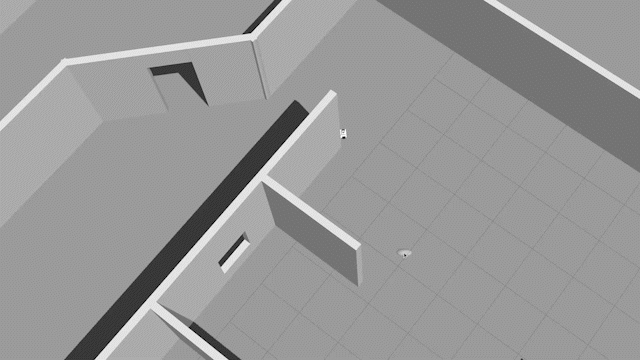
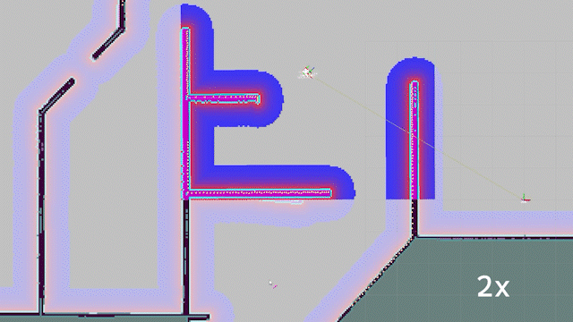

### StaggerLite


- ROS Project of a self made differential drive robot

#### Hardware

- X86 mini computer with N5105 CPU
- STM32F407
- Lidar
- Depth camera
- Direct Drive Motor

|  |
| :---------------------------------------------: |
|                    drifting                     |

#### Requirements

- Ubuntu 20.04
- ROS Noetic

#### Installation

```bash
sudo apt install ros-noetic-map-server ros-noetic-serial
```

```bash
cd ${HOME}
mkdir -p catkin_ws/src
cd catkin_ws/src
git clone https://github.com/NeoThings/StaggerLite.git
cd StaggerLite/staggerlite_scripts
. install_cartographer.bash
. install_navigation.bash
. install_sensors_driver.bash
```

```bash
cd ${HOME}/catkin_ws
catkin_make
```

```bash
echo "source ${HOME}/staggerlite_ws/devel/setup.bash --extend" >> ~/.bashrc
source ~/.bashrc
```

#### Run simulation

```bash
roslaunch staggerlite_bringup sim_start.launch 
```

|  |  |
| :--------------------------------------------------: | :------------------------------------------------: |
|                    nav in gazebo                     |                    nav in rviz                     |

#### Run a real robot

```bash
roslaunch staggerlite_bringup staggerlite_bringup.launch #navigation
roslaunch staggerlite_mapping carto_mapping.launch #mapping
```

|  |  |
| :--------------------------------------------------: | :-----------------------------------------------: |
|                      navigation                      |                      mapping                      |

